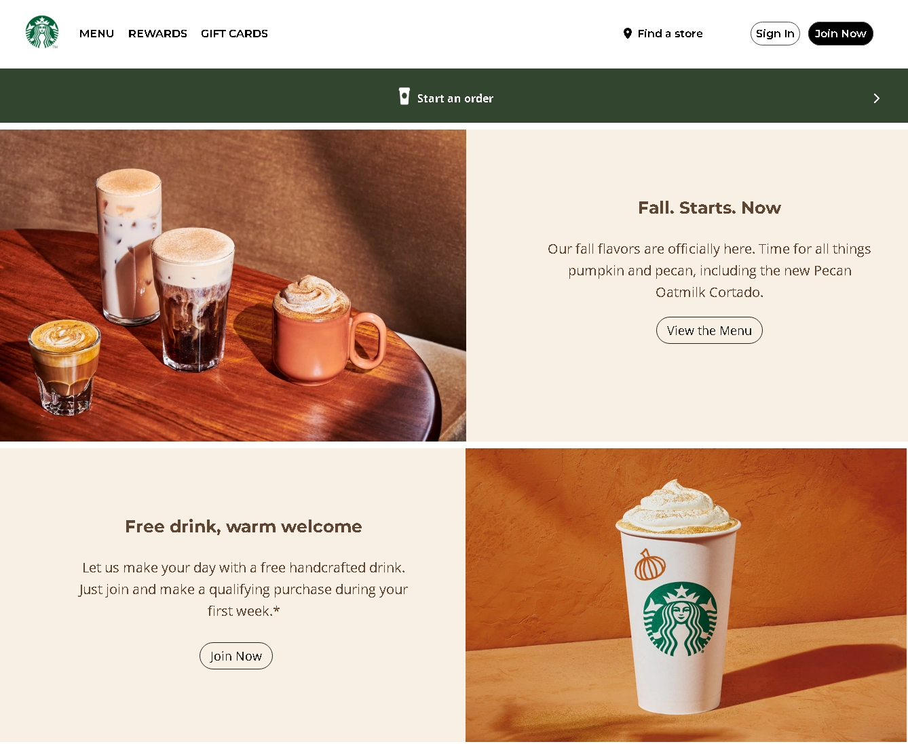
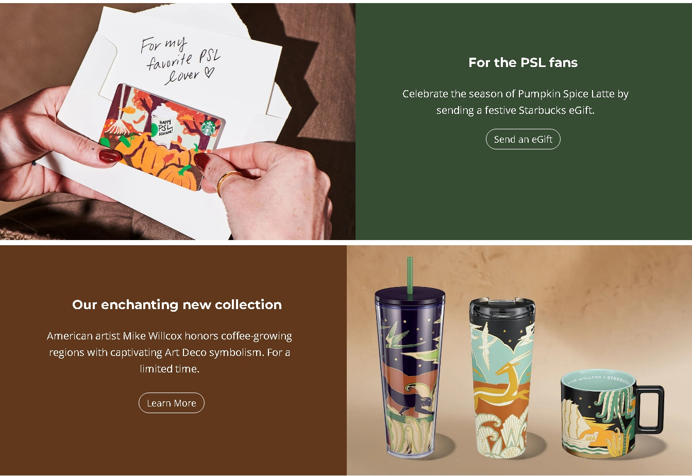
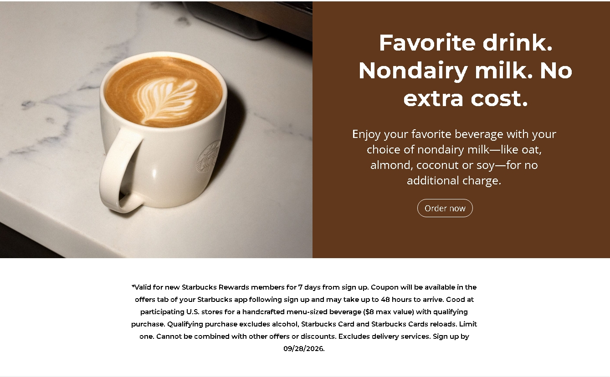
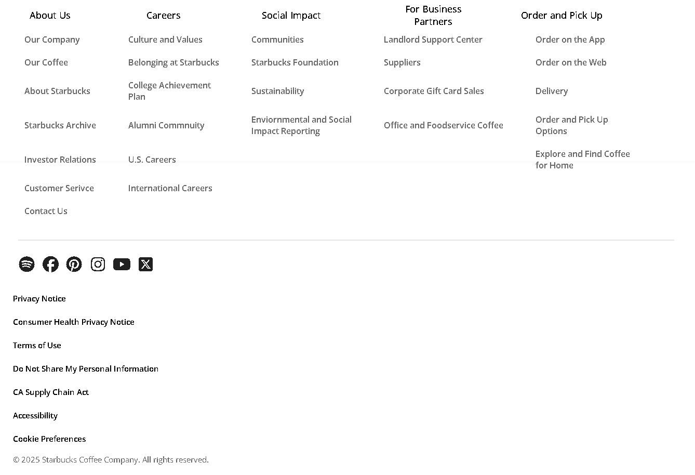

☕ Starbucks Clone – Frontend
A fully responsive frontend clone of the Starbucks website built using HTML and CSS.
This project was created as a practice build and a portfolio piece to strengthen my frontend fundamentals and UI design skills.

✨ Features
(1) Clean and structured UI inspired by Starbucks
(2) Pixel-level attention to design and spacing
(3) Smooth and consistent styling across pages
(4) Beginner-friendly, lightweight implementation

🛠️ Tech Stack
HTML5
CSS3

🎯 Purpose
This project helped me practice:
(1) Layout building
(2) CSS styling techniques
(3) UI structuring
(4) Attention to detail in frontend design

📸 Preview 

  
  

  
  

